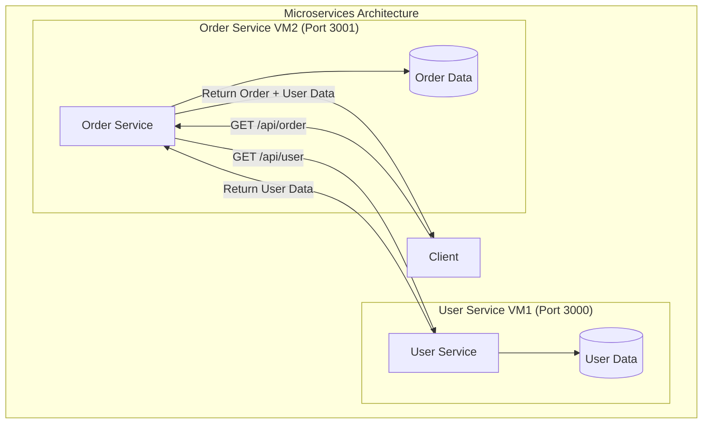

# Microservices Order Management System

This project implements a microservices-based order management system consisting of two services: a User Service and an Order Service. The services are designed to run on separate VMs and communicate via REST APIs.

## Architecture



## Services

### User Service
- Port: 3000
- Provides user information
- Endpoints:
  - GET `/api/user`: Returns user details

### Order Service
- Port: 3001
- Manages order creation
- Communicates with User Service
- Endpoints:
  - GET `/api/order`: Creates and returns an order with user details

## Prerequisites

- Node.js (v14 or higher)
- npm (Node Package Manager)
- Two VMs or hosts for running the services

## Installation & Setup

### User Service

1. Navigate to the user-service directory:
   ```bash
   cd user-service
   ```

2. Install dependencies:
   ```bash
   npm install
   ```

3. Start the service:
   ```bash
   node server.js
   ```

The service will be available at `http://localhost:3000`

### Order Service

1. Navigate to the order-service directory:
   ```bash
   cd order-service
   ```

2. Install dependencies:
   ```bash
   npm install
   ```

3. Update the User Service IP address in `server.js` to match your VM1's IP address

4. Start the service:
   ```bash
   node server.js
   ```

The service will be available at `http://localhost:3001`

## Dependencies

### User Service
- express: ^4.21.2
- cors: ^2.8.5

### Order Service
- express: ^4.21.2
- axios: ^1.7.9
- cors: ^2.8.5

## API Documentation

### User Service API

#### GET /api/user
Returns user information

Response:
```json
{
    "id": 1,
    "name": "John Doe",
    "email": "john@example.com"
}
```

### Order Service API

#### GET /api/order
Creates and returns an order with user information

Response:
```json
{
    "orderId": 101,
    "user": {
        "id": 1,
        "name": "John Doe",
        "email": "john@example.com"
    },
    "product": {
        "name": "Sample Product",
        "price": 100
    },
    "status": "created"
}
```

## Deployment

1. Deploy User Service on VM1
2. Note down VM1's IP address
3. Update the User Service URL in Order Service's `server.js`
4. Deploy Order Service on VM2

## Error Handling

Both services include basic error handling:
- User Service returns appropriate HTTP status codes
- Order Service handles communication errors with User Service

## Future Improvements

1. Add authentication and authorization
2. Implement database persistence
3. Add more order management features
4. Implement proper logging
5. Add testing
6. Add Docker support for easier deployment

## License

ISC 